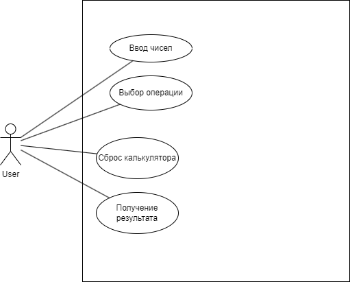

# Лабораторная работа №3: Программа "Калькулятор". Требования к программе

Программа-калькулятор выполняет простые арифметические операции: сложение, вычитание, умножение, деление, возведение в степень. Программа помогает при пересчете чеков, сдачи или стоимости ЖКХ.

## Оглавление

- [Лабораторная работа №3: Программа "Калькулятор". Требования к программе](#лабораторная-работа-3-программа-калькулятор-требования-к-программе)
  - [Оглавление](#оглавление)
  - [1. Назначение программы](#1-назначение-программы)
  - [2. Функциональные требования](#2-функциональные-требования)
    - [Интерфейс пользователя](#интерфейс-пользователя)
    - [Ввод чисел и алгоритм работы](#ввод-чисел-и-алгоритм-работы)
    - [Выполнение операций над числами](#выполнение-операций-над-числами)
    - [Операции](#операции)
  - [3. Нефункциональные требования](#3-нефункциональные-требования)
    - [Удобство использования](#удобство-использования)
    - [Производительность](#производительность)
    - [Совместимость](#совместимость)
  - [4. Тестирование и верификация](#4-тестирование-и-верификация)
    - [Тестирование пользовательского интерфейса](#тестирование-пользовательского-интерфейса)
    - [Тестирование операций](#тестирование-операций)
  - [5. Выводы](#5-выводы)

## 1. Назначение программы

Программа-калькулятор выполняет простые арифметические операции: сложение, вычитание, умножение, деление, возведение в степень. Программа помогает при пересчете чеков, сдачи или стоимости ЖКХ.

## 2. Функциональные требования

### Интерфейс пользователя

- **F.IF-1**: Программа должна предоставлять графический интерфейс пользователя, который повторяет стиль классических электронных калькуляторов.
- **F.IF-2**: Интерфейс должен содержать:
  - Строку меню в верхней части экрана.
  - Поле для отображения текущего выражения и результата.
  - Кнопки с цифрами (0–9), кнопки операций (+, -, \*, /, ^, =, C) и кнопку для ввода десятичной точки (.).
- **F.IF-3**: Кнопка "." должна позволять вводить числа с плавающей запятой

### Ввод чисел и алгоритм работы

- **F.INP-1**: Программа после запуска должна ожидать ввода пользователя, обрабатывать ввод, выводить результат, а затем снова ожидать ввода.
- **F.INP-2**: При нажатии на кнопку с цифрой программа должна дописать цифру в младший разряд числа.
- **F.INP-3**: В случае ошибки ввода или выполнения операции программа должна выводить строку "err" вместо результата.
- **F.INP-4**: Программа должна следовать алгоритму работы:

  ```python
  while True:
      digit, op = parse(input())
      if digit:
          # дописать цифру к числу
          ...
          continue;
      if op:
          # если операция выполнима - вычислить и выдать результат
          # если не выполнима - выдать ошибку
          ...
          continue;
      break;
  ```

### Выполнение операций над числами

- **F.OP-1**: Программа должна поддерживать следующие операции:
  - Сложение (+)
  - Вычитание (-)
  - Умножение (\*)
  - Деление (/)
  - Возведение в степень (^)
- **F.OP-2**: Все операции должны выполняться с числами с плавающей запятой.
- **F.OP-3**: При попытке деления на ноль программа должна выводить сообщение "err".

### Операции

- **F.SUM-1**: Операция сложения должна возвращать сумму двух операндов (для чисел a и b возвращать результат a + b).
- **F.SUB-1**: Операция вычитания должна возвращать разность первого и второго операнда (для чисел a и b возвращать результат a - b).
- **F.MUL-1**: Операция умножения должна возвращать произведение двух операндов (для чисел a и b возвращать результат a \* b).
- **F.DIV-1**: Операция деления должна возвращать частное двух операндов (для чисел a и b возвращать результат a / b). При делении на ноль программа должна выводить "err".
- **F.POW-1**: Операция возведения в степень должна возвращать результат возведения первого операнда в степень второго (для чисел a и b возвращать результат a ^ b).

## 2.1 Диаграмма вариантов использования

Ниже представлена диаграмма вариантов использования для программы-калькулятора, описывающая основные взаимодействия пользователя с системой:



- **User**: Основной актер, который взаимодействует с калькулятором.
- **Ввод чисел**: Пользователь вводит операнды для вычислений, включая числа с плавающей запятой с помощью кнопки ".".
- **Выбор операции**: Пользователь выбирает одну из доступных арифметических операций (+, -, \*, /, ^).
- **Получение результата**: Пользователь получает результат вычисления после нажатия кнопки "=".
- **Сброс калькулятора**: Пользователь очищает текущие данные для нового вычисления с помощью кнопки "C".

## 3. Нефункциональные требования

### Удобство использования

- **NF.UX-1**: Кнопки и шрифты должны быть достаточно крупными для удобства использования.
- **NF.UX-2**: Нажатие на кнопку операции или цифры должно сопровождаться визуальным подтверждением (например, изменение цвета при нажатии).
- **NF.UX-3**: Звуковое подтверждение должно быть настраиваемым (включение/отключение).

### Производительность

- **NF.PRF-1**: Время выполнения операций не должно превышать 200 мс с момента нажатия кнопки до отображения результата.

### Совместимость

- **NF.CMP-1**: Программа должна быть разработана для ОС Android.
- **NF.CMP-2**: Приложение должно корректно работать на устройствах с различными разрешениями экрана.

## 4. Тестирование и верификация

### Тестирование пользовательского интерфейса

- **T.UI-1**: Проверить корректность отображения интерфейса на разных устройствах.
- **T.UI-2**: Убедиться, что все кнопки работают корректно и имеют обратную связь (визуальную и/или звуковую).

### Тестирование операций

- **T.OP-1**: Проверить корректность выполнения всех арифметических операций: сложение, вычитание, умножение, деление, возведение в степень.
- **T.OP-2**: Проверить обработку ошибок (например, деление на ноль).
- **T.OP-3**: Убедиться, что результаты вычислений соответствуют ожидаемым значениям.
- **T.OP-4**: Проверить корректность вычислений с числами с плавающей запятой.

## 5. Выводы

В рамках работы были сформулированы детализированные требования к программе "Калькулятор", включающие функциональные и нефункциональные требования, а также тестовые сценарии. Четкое определение требований способствует высокому качеству конечного продукта и обеспечению удобства использования.
